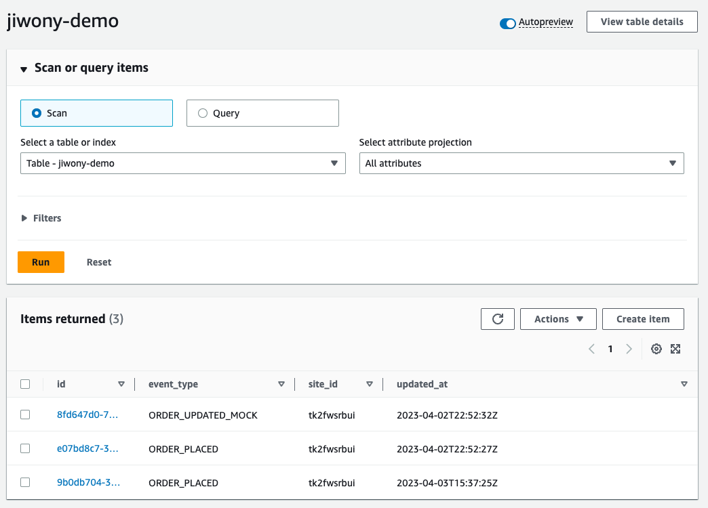

# How SupaDupa Analytics Solution integrates with Buy with Prime

You are a superstar developer of SupaDupa Analytics Solution, which provides data analytics service for eCommerce business. You've got to know Buy with Prime helps the merchants to provide Prime benefits from their website, basically off Amazon! You are so excited and want to create some business opportunity for your company as well by providing your services to merchants using Buy with Prime using. Where should we start? [This workshop](https://catalog.us-east-1.prod.workshops.aws/workshops/2b14c78c-56e3-4ed8-b44a-4984094ec8c4/en-US) will guide you through the journey for the integration. This repository is the final artifact that you would get as a result of completing the workshop. To start off from the beginning without onboarding to Buy with Prime, follow the instructions under **(Optional) How to get started to onboard to Buy with Prime APIs**.

**What's not included in the demo**
- Dynamically calling Order details using Order ID handed down from Events generated by ENS. (Due to lack of mock Order)
- Event bus and Rule creation after being allowlisted by Buy with Prime Event source. The developers can achieve this by following the guidance from [this document](https://partners.buywithprime.amazon.com/support/documentation?redirect=%2Fprivate%2Fdocs%2Fbuy-with-prime-event-integration-guide)

## Demo architecture


### Demo source code break down
1. `lib` includes AWS resources required to run the demo application to obtain OAuth 2.0 token, subscribe the event, query GraphQL API endpoint and store the data.
    1. SQS Queue - as a target of Event bus rule
    2. 2 DynamoDB Tables - one for storing token and the other for received events.
    3. Lambda - Triggered by the queue, connected to Event source. Queries GraphQL API endpoint.
    4. Application Load Balancer and EC2 resources - Serves as OAuth handler.
2. `src` includes the Lambda logic and OAuth handling logic.

### Demo flow
1. Test event generated by running this script
2. Event Bus captures the incoming Event
3. SQS takes the message with DeadLetterQueue setup
4. Lambda is triggered to take the Event generated time and queries the API to obtain the Store's `siteId`. Then it stores the result to DynamoDB.
5. In DynamoDB table, you can check the new Item created.
    

## (Optional) How to get started to onboard to Buy with Prime APIs
You can use this repository to create the redirect urls that you need for [onboarding to Buy with Prime APIs](https://documents.partners.buywithprime.amazon.com/private/docs/onboarding-for-oauth-20). Please follow the steps listed below. It requires you to have AWS CLI configured already if you have not already please check [this page](https://catalog.us-east-1.prod.workshops.aws/workshops/2b14c78c-56e3-4ed8-b44a-4984094ec8c4/en-US/1-introduction/110-prereq) out and complete the setting. 

1. Clone this repository to start off
    ```
    git clone https://github.com/amzn/buy-with-prime-saas-integration.git //(특정 브랜치)
    cd buy-with-prime-saas-integration
    ```

2. Deploy this CDK package to your environment
    ```
    export ACCOUNT_ID=$(aws sts get-caller-identity --query 'Account' --output text)
    cdk bootstrap ACCOUNT_ID/<<YOUR_CHOICE_OF_REGION>>
    cdk deploy
    ```

3. When it completes, you will see the created domain name for the load balancer and use it for onboarding!


## Security

See [CONTRIBUTING](CONTRIBUTING.md#security-issue-notifications) for more information.

## License

This library is licensed under the MIT-0 License. See the LICENSE file.

