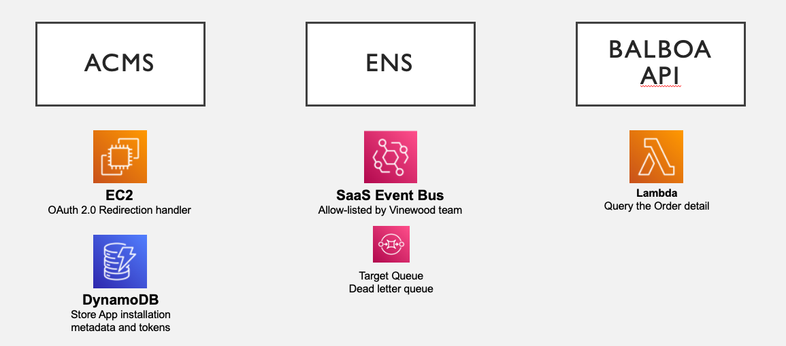
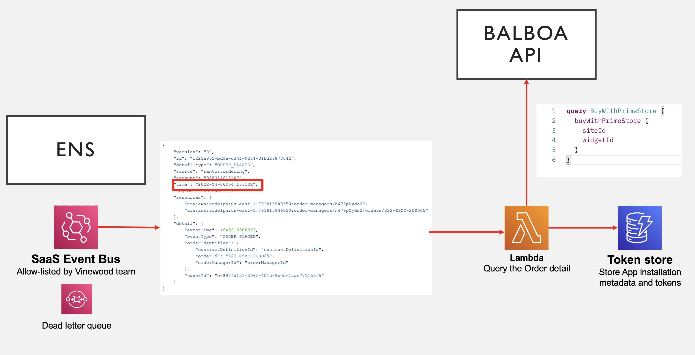

# Jiwon's demo data service using Balboa and ENS

Jiwon's demo data service collects the Merchant's events from ENS and store it to AWS DynamoDB. You can find the app from BwP Marketplace using [this link](https://console.buywithprime.amazon.com/marketplace/prod-xnmfhldrvynv6).

**What's not included in the demo**
- Dynamically calling Order details using Order ID handed down from Events generated by ENS. (Due to lack of mock Order)
- Event bus and Rule creation after being allowlisted by ENS. The developers can achieve this by following the guidance from [this document](https://partners.buywithprime.amazon.com/support/documentation?redirect=%2Fprivate%2Fdocs%2Fbuy-with-prime-event-integration-guide)

## Demo architecture

## Demo source code break down
1. `lib` includes AWS resources required to run the demo application to obtain OAuth 2.0 token, subscribe the event, query Balboa endpoint and store the data.
    1. SQS Queue - as a target of Event bus rule
    2. 2 DynamoDB Tables - one for storing token and the other for received events.
    3. Lambda - Triggered by the queue, connected to ENS. Queries Balboa endpoint.
    4. Application Load Balancer and EC2 resources - Serves as OAuth handler.
2. `src` includes the Lambda logic and OAuth handling logic.

## Demo flow

1. Test event generated by running this script
2. Event Bus captures the incoming Event
3. SQS takes the message with DeadLetterQueue setup
4. Lambda is triggered to take the Event generated time and queries Balboa to obtain the Store's `siteId`. Then it stores the result to DynamoDB.
5. In DynamoDB table, you can check the new Item created.
    

## Useful commands

* `npm run build`   compile typescript to js
* `npm run watch`   watch for changes and compile
* `npm run test`    perform the jest unit tests
* `cdk deploy`      deploy this stack to your default AWS account/region
* `cdk diff`        compare deployed stack with current state
* `cdk synth`       emits the synthesized CloudFormation template

## Security

See [CONTRIBUTING](CONTRIBUTING.md#security-issue-notifications) for more information.

## License

This library is licensed under the MIT-0 License. See the LICENSE file.

