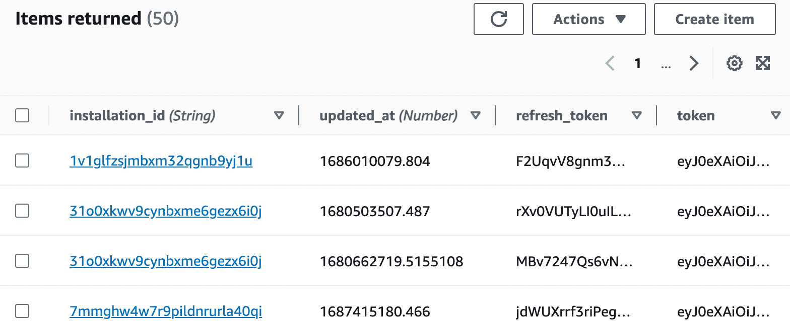
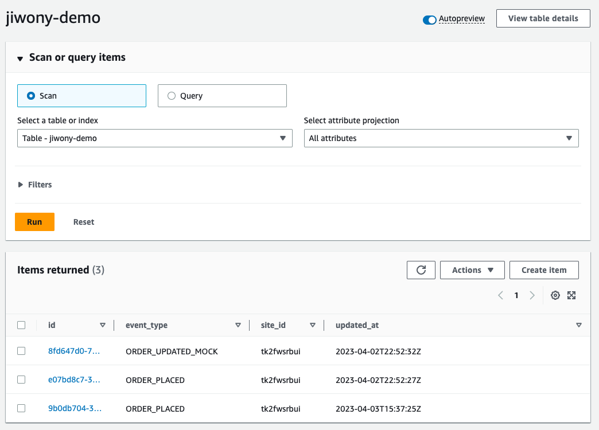

# Build a SaaS integration for Buy with Prime

## Where to start? 
Find here the up-to-date official [Build a SaaS integraion for Buy with Prime workshop.](https://catalog.workshops.aws/bwp-saas-integration/en-US) The workshop walk you through the journey for building a Buy with Prime app. This repository is the final artifact that you would get as a result of completing the workshop. 

## Demo architecture


## Demo source code break down
- `codes` has OAuth handler application codes and Buy with Prime event handler Lambda code.
- `ecs-cdk` defines your CDK application.
  - `lib/` is where your CDK application’s main stack is defined. This is the file we’ll be spending most of our time in.
    - `lib/infra-stack.ts` defines **InfraStack,** including Amazon VPC, Application Load Balancer, Amazon ECR repository, and Amazon DynamoDB table. You need ALB DNS when you request app onboarding. 
    - `lib/ecs-fargate-stack.ts` defines AWS Fargate OAuth handler. Before deploying **EcsStack**, you need Client ID and Client Secret as a result of app onboarding. 
    - `lib/event-stack.ts` is optional. If your use cases require near real time event syncs, you can request event subscription via Amazon Eventbridge. If not, you can skip deploying **EventStack.**
  - `bin/ecs-cdk.ts` is the entrypoint of the CDK application. It will load the stack defined in `lib/infra-stack.ts`,`lib/ecs-fargate-stack.ts`, and `lib/event-stack.ts`.
- `package.json` is your npm module manifest. It includes information like the name of your app, version, dependencies and build scripts like “watch” and “build” (package-lock.json is maintained by npm)
- `cdk.json` tells the toolkit how to run your app. In our case it will be `npx ts-node bin/api-demo-infra.ts`
- `tsconfig.json` your project’s typescript configuration
- `.gitignore` and `.npmignore` tell git and npm which files to include/exclude from source control and when publishing this module to the package manager.

## Workshop flow
### Preparation
```
git clone https://github.com/amzn/buy-with-prime-saas-integration.git
cd buy-with-prime-saas-integration/ecs-cdk
npm i
cdk bootstrap
```

### InfraStack
- Deploy `InfraStack`
```
cd ecs-cdk
cdk deploy InfraStack
```
- You will see the result. Use `InfraStack.loadbalancerDnsUrl` when requesting app onboarding. You should use lowercased DNS without Capitals. Please request app onboarding with **http://** in front of the DNS URL, unless you configure **https.**
```
url="Infra-Oauth-1T950NUUBLABLA-1234796353.us-west-1.elb.amazonaws.com"
echo "$url" | awk '{print tolower($0)}'
infra-oauth-1t950nuublabla-1234796353.us-west-1.elb.amazonaws.com
```
- Your app onboarding request may take up to 2 business days to complete. Once completed, you will have your `Client ID` for your app. 
- Once your app onboarding request approved, generate `Client secret` for your app. Follow instruction from [App Onboarding for OAuth 2.0](https://documents.partners.buywithprime.amazon.com/private/docs/onboarding-for-oauth-20#client-secret-retrieval) in Buy with Prime Partner Document hub (Authentication required). 
- Store `Client ID` and `Client secret` in `.env`

### EcsStack
- Run `docker.sh` to build Docker image and push it to ECR repository. 
```
export AWS_REGION=us-east-1 // Your region
chmod +x docker.sh
./docker.sh
```
- Deploy `EcsStack`
```
cdk deploy EcsStack
```
- Check your OAuth token in Amazon DynamoDB Token Store. Use the token to query Buy with Prime API. 


### (Optioanl) Event Stack
- Request event subscription. As a result, you will have Amazon EventBridge Partner Event Source created in your AWS account.
- Update `.env` file with the Amazon EventBridge's ARN (Amazon Resource Name).
- Open `/bin/ecs-cdk.ts` and uncomment `EventStack` out (Line 30~36)
- Deploy `EventStack`
```
cdk deploy EventStack
```
- You can generate test event to validate if your EventStack works properly. Talk to your Buy with Prime SA. 

### (Optional) Event flow
1. Test event generated by running this script
2. Event Bus captures the incoming Event
3. SQS takes the message with DeadLetterQueue setup
4. Lambda is triggered to take the Event generated time and queries the API to obtain the Store's `siteId`. Then it stores the result to DynamoDB.
5. In DynamoDB table, you can check the new Item created.
  

**What's not included in the demo**
- Dynamically calling Order details using Order ID handed down from Events generated by ENS. (Due to lack of mock Order)
- Event bus and Rule creation after being allowlisted by Buy with Prime Event source. The developers can achieve this by following the guidance from [this document](https://partners.buywithprime.amazon.com/support/documentation?redirect=%2Fprivate%2Fdocs%2Fbuy-with-prime-event-integration-guide)


## Security

See [CONTRIBUTING](CONTRIBUTING.md#security-issue-notifications) for more information.

## License

This library is licensed under the MIT-0 License. See the LICENSE file.

## Disclaimer
This sample code is to accelerate your development journey, not meant to be used in production. Your resources and services have to be updated and configured security — including any required patches — to meet your security and other needs. For more information, see the [AWS Shared Responsibility Model.](https://aws.amazon.com/compliance/shared-responsibility-model/)

## References
- [Buy with Prime API reference](https://documents.partners.buywithprime.amazon.com/private/page/api-reference)
- [Buy with Prime Event Integration Guide](https://documents.partners.buywithprime.amazon.com/private/docs/buy-with-prime-event-integration-guide)